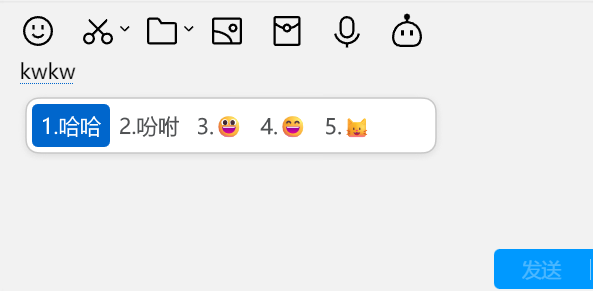

# 📚 emoji 的中文五笔码表

用于给输入法打汉字时联想 emoji 😊

支持 86 版五笔和 98 版五笔。新增编码生成十分简单，可自己魔改。

- 对于重码大于 6 的词（比如“旗”，对应了 200+ 个 emoji），只输出前 2 条 emoji。处理方式偏向于作为 emoji 联想，而非 emoji 查询。
- 单字多码时，只匹配最简码，如“女”字，只有打“v”会出现👩，“vv”和“vvv”不会出现 emoji，以降低对正常打字的干扰。

🔎 **预览**




## 👐 使用方式

导入 `dict` 下对应的码表文件至输入法的用户词典。

码表格式： `编码<Tab>emoji`

可能需要自己写输入法兼容的格式转换。部分输入法需要设置词频，建议权重在3码往后。

## 运行

python version > 3.10。更低版本不支持 match 语法。无额外依赖。

在命令行运行以下代码以生成对应码表。

```
python convert.py --code wubi86
python convert.py --code wubi98
```
输出码表文件位于 `dict` 目录下。
数据源：[zhmoji](https://github.com/yuhangch/zhmoji)。见 `emoji.json`  
五笔编码文件位于 `codecs` 目录下。 

## 相关数据

- [zhmoji](https://github.com/yuhangch/zhmoji)
- [五笔输入法86版](http://86wb.ysepan.com/)
- [98五笔资源库](http://98wb.ysepan.com/)
- [Emoji大全](https://www.emojiall.com/zh-hans)

## License

Code by sansui233, MIT License